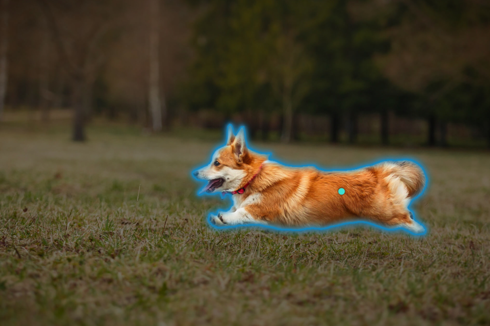
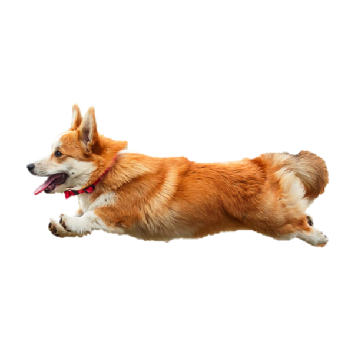
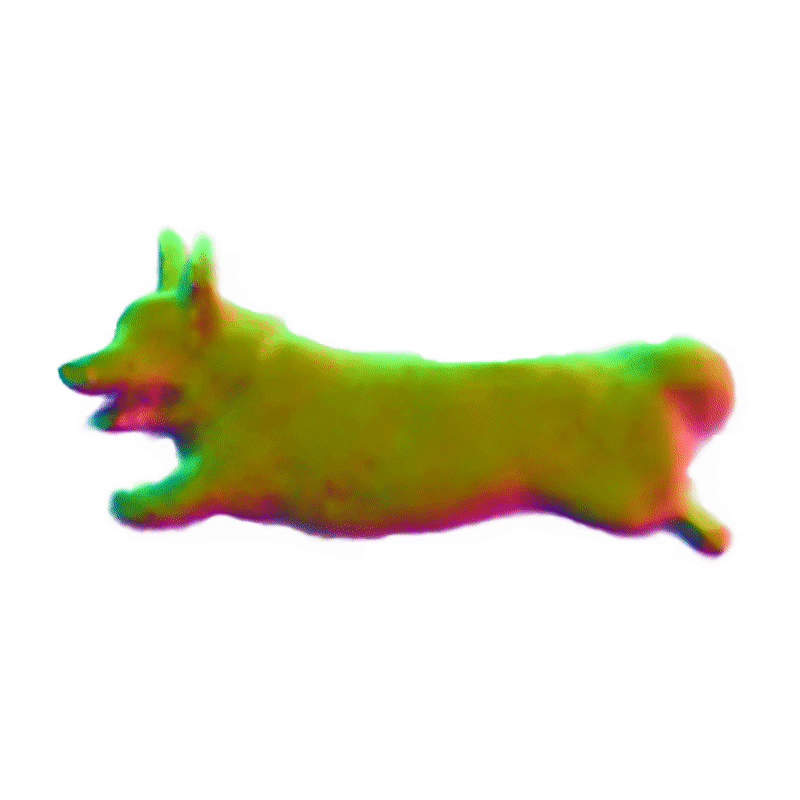

# Make-It-3D: High-Fidelity 3D Creation from A Single Image with Diffusion Prior (ICCV 2023)
<!--  -->
<div class="half">
    
</div>
<div class="half">
    
</div>

### [Project page](https://make-it-3d.github.io/) |   [Paper](https://arxiv.org/abs/2303.14184) 
<!-- <br> -->
[Junshu Tang](https://junshutang.github.io/), [Tengfei Wang](https://tengfei-wang.github.io/), [Bo Zhang](https://bo-zhang.me/), [Ting Zhang](https://www.microsoft.com/en-us/research/people/tinzhan/), [Ran Yi](https://yiranran.github.io/), [Lizhuang Ma](https://dmcv.sjtu.edu.cn/), and [Dong Chen](https://www.microsoft.com/en-us/research/people/doch/).
<!-- <br> -->

## Abstract
>In this work, we investigate the problem of creating high-fidelity 3D content from only a single image. This is inherently challenging: it essentially involves estimating the underlying 3D geometry while simultaneously hallucinating unseen textures. To address this challenge, we leverage prior knowledge from a well-trained 2D diffusion model to act as 3D-aware supervision for 3D creation. Our approach, Make-It-3D, employs a two-stage optimization pipeline: the first stage optimizes a neural radiance field by incorporating constraints from the reference image at the frontal view and diffusion prior at novel views; the second stage transforms the coarse model into textured point clouds and further elevates the realism with diffusion prior while leveraging the high-quality textures from the reference image. Extensive experiments demonstrate that our method outperforms prior works by a large margin, resulting in faithful reconstructions and impressive visual quality. Our method presents the first attempt to achieve high-quality 3D creation from a single image for general objects and enables various applications such as text-to-3D creation and texture editing.


## Todo (Latest update: 2023/07/01)
- [x] **Release coarse stage training code**
- [x] **Release all training code (coarse + [refine stage](#refine-stage))**
- [ ] Release the test benchmark for all results in the paper
- [ ] Release more applications

## Demo of 360° geometry
<div class="half">
    
</div>

## SAM + Make-It-3D
<div class="half">
    
</div>


## Installation
Install with pip:
```
    pip install torch==1.10.0+cu113 torchvision==0.11.1+cu113 torchaudio===0.10.0+cu113 -f https://download.pytorch.org/whl/cu113/torch_stable.html
    pip install git+https://github.com/NVlabs/tiny-cuda-nn/#subdirectory=bindings/torch
    pip install git+https://github.com/openai/CLIP.git
    pip install git+https://github.com/huggingface/diffusers.git
    pip install git+https://github.com/huggingface/huggingface_hub.git
    pip install git+https://github.com/facebookresearch/pytorch3d.git
    pip install git+https://github.com/S-aiueo32/contextual_loss_pytorch.git
```
Other dependencies:
```
    pip install -r requirements.txt 
    pip install ./raymarching
```
Training requirements
- [DPT](https://github.com/isl-org/DPT). We use an off-the-shelf single-view depth estimator DPT to predict the depth for the reference image.
  ```
  git clone https://github.com/isl-org/DPT.git
  mkdir dpt_weights
  ```
  Download the pretrained model [dpt_hybrid](https://github.com/intel-isl/DPT/releases/download/1_0/dpt_hybrid-midas-501f0c75.pt), and put it in `dpt_weights`.
- [SAM](https://github.com/facebookresearch/segment-anything). We use Segment-anything-model to obtain the foreground object mask.
- [BLIP2](https://arxiv.org/abs/2301.12597). We use BLIP2 to generate a caption. You can also modify the conditioned text using `--text "{TEXT}"` which will greatly reduce time.
- [Stable Diffusion](https://huggingface.co/models?other=stable-diffusion). We use diffusion prior from a pretrained 2D Stable Diffusion 2.0 model. To start with, you may need a huggingface [token](https://huggingface.co/settings/tokens) to access the model, or use `huggingface-cli login` command.
## Training 
### Coarse stage
We use progressive training strategy to generate a full 360° 3D geometry. Run the command and modify the workspace name `NAME` and the path of the reference image `IMGPATH`. We first optimize the scene under frontal camera views. 
```
    python main.py --workspace ${NAME} --ref_path "${IMGPATH}" --phi_range 135 225 --iters 2000 
```
Then we spread the camera view samples to full 360°. If you need a prompt condition "back view", you can use the command `--need_back`.
```
    python main.py --workspace ${NAME} --ref_path "${IMGPATH}" --phi_range 0 360 --albedo_iters 3500 --iters 5000 --final
```
If you encounter `long geometry` issue, you can try to increase the reference fov and adjust relative setting. For example:
```
    python main.py --workspace ${NAME} --ref_path "${IMGPATH}" --phi_range 135 225 --iters 2000 --fov 60 --fovy_range 50 70 --blob_radius 0.2
```
### Refine stage

After the coarse stage training, now you can easily use the command `--refine` for refine stage training. We optimize the scene under frontal camera views. 
```
    python main.py --workspace ${NAME} --ref_path "${IMGPATH}" --phi_range 135 225 --refine
```
You can modify the value of training iterations using the command `--refine_iters`.
```
    python main.py --workspace ${NAME} --ref_path "${IMGPATH}" --phi_range 135 225 --refine_iters 3000 --refine
```
**Note:** We additionally use `contextual loss` on the refine stage, we find it helps to sharpen the texture. You may need to install [contextual_loss_pytorch](https://github.com/S-aiueo32/contextual_loss_pytorch) before training.
```
    pip install git+https://github.com/S-aiueo32/contextual_loss_pytorch.git
```

## Important Note
Hallucinating 3D geometry and generating novel views from a single image of general genre is a challenging task. While our method demonstrates strong capability on creating 3D from most images with a centered single object, it may still encounter difficulties in reconstructing solid geometry on complex cases. **If you encounter any bugs, please feel free to contact us.**


## Citation
If you find this code helpful for your research, please cite:
```
@article{tang2023make,
  title={Make-It-3D: High-Fidelity 3D Creation from A Single Image with Diffusion Prior},
  author={Tang, Junshu and Wang, Tengfei and Zhang, Bo and Zhang, Ting and Yi, Ran and Ma, Lizhuang and Chen, Dong},
  journal={arXiv preprint arXiv:2303.14184},
  year={2023}
}
```

## Acknowledgments
This code borrows heavily from [Stable-Dreamfusion](https://github.com/ashawkey/stable-dreamfusion). 
